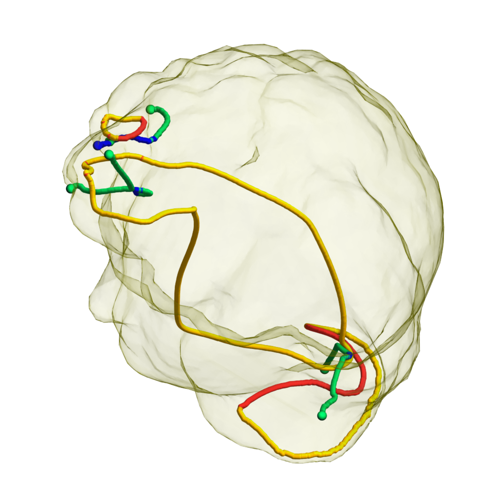
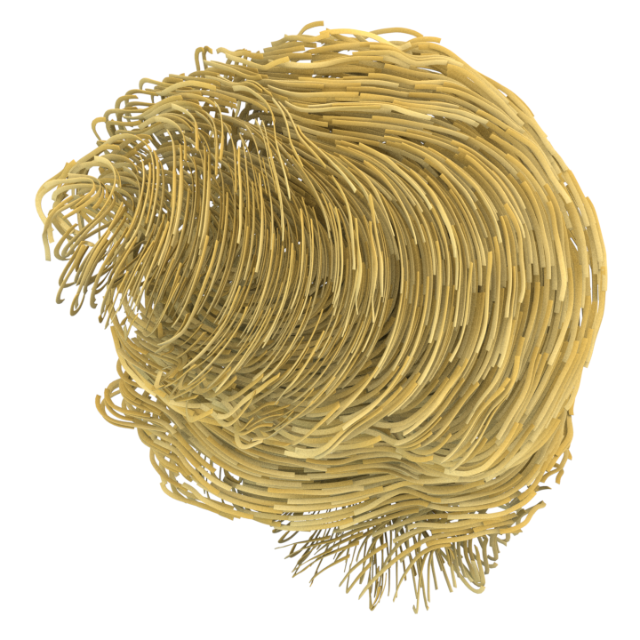

# Tensor Field Design in Volumes #

Jonathan Palacios,  Lawrence Roy,  Prashant Kumar,  Chen-Yuan Hsu,  Weikai Chen,  Chongyang Ma,  Li-Yi Wei,  Eugene Zhang

SIGGRAPH Asia 2017

## Abstract ##

3D tensor field design is important in several graphics applications such as procedural noise, solid texturing, and geometry synthesis.
Different fields can lead to different visual effects. 
The topology of a tensor field, such as degenerate tensors, can cause artifacts in these applications.
Existing 2D tensor field design systems cannot be used to handle the topology of a 3D tensor field.
In this paper, we present to our knowledge the first 3D tensor field design system.
At the core of our system is the ability to edit the topology of tensor fields.
We demonstrate the power of our design system with applications in solid texturing and geometry synthesis.

## Available information ##

<!--
[[paper](https://doi.org/10.1145/3130800.3130844)]
-->
[[brief](http://www.liyiwei.org/papers/texture-siga16/tfdv_siga16.pdf)]
[[video (youtube)](https://youtu.be/n_SkJSiJLf4)]
